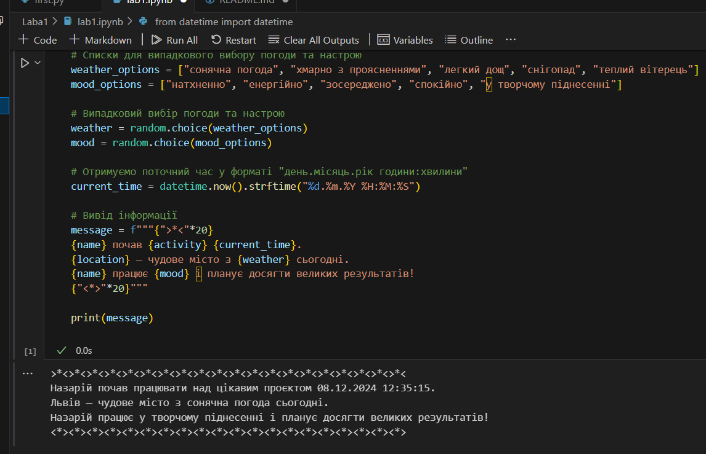

# Звіт до першої лабораторної
## Тема: перша програма на мові *Python*

### Виконання роботи
- Результати виконання завдання:
    1. Виконали першу програму, результат виконання: ;
    1. Модифікували програму та використали [Python Notebook для її виконання](lab1.ipynb);
    
    
    
    1. Програма вивела значення
    1. Отримано наступні результати: 
Роман почав програмувати о 08.12.2024 12:55:45.

    5. Навчились прості програми на мові Python


___


```Python
from datetime import datetime

name = "Роман"
activity = "програмувати"

current_time = datetime.now().strftime("%d.%m.%Y %H:%M:%S")

print(f"{name} почав {activity} о {current_time}.")


```
